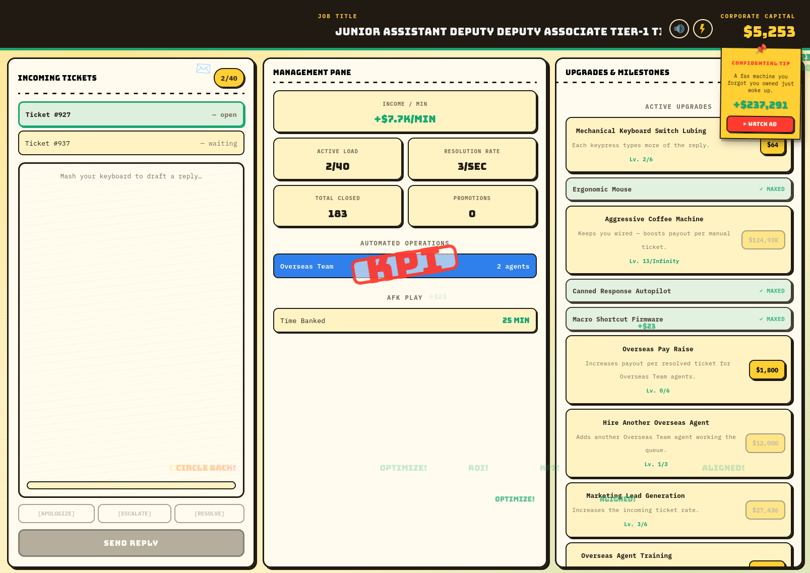

<div align="center">

# Corporate Capital

### Climb the ladder. Step on whoever's below you.

**An incremental clicker about grinding your way up the corporate ladder, one soul-crushing customer service ticket at a time.**

[](https://playgama.com/game/corporate-capital)

[Play now →](https://playgama.com/game/corporate-capital)

</div>

---



## What it is

You work support. Tickets arrive, you type a reply, you get paid. That's the whole
job, and the whole game — until it isn't.

Reinvest your earnings into upgrades. Outsource the job to overseas agents. Replace
those agents with an AI chatbot, because nothing says *synergy* like automating
yourself out of relevance. Take the promotion, start again as HR, deny some leave
requests, deploy HR bots, fire your own middle managers. Do it all again, one rung
higher and more absurd than the last.

There's no traditional win. There's an ever-escalating loop of automation and
promotion, and a slowly dawning realization: the more efficient you get, the less
anyone — including you — is actually needed.

## How to play

Resolve tickets, earn **Corporate Capital**, and buy upgrades and milestones until
you can accept a promotion. Then do it all again in a new role.

| Desktop | |
| --- | --- |
| <kbd>Any</kbd> letter / number / space | Type out a reply to the active ticket |
| <kbd>Enter</kbd> | Send the reply, or add a keystroke if it isn't ready |
| <kbd>Click</kbd> | Buy upgrades and milestones, use canned responses, toggle audio |

| Mobile | |
| --- | --- |
| On-screen keyboard | Tap a key to draft your reply |
| <kbd>Tap</kbd> | Send, canned responses, upgrade and milestone purchases |
| Tab bar | Switch between the Queue, Dashboard, and Upgrades panels |

Two things worth knowing: **canned responses** let you close a ticket in one tap
once you unlock them, and **AFK play** lets the office keep working while you're
away — buy your first automation upgrade to switch that on.

Want the store-listing copy and the full audio cue table? See [PLAYGAMA.md](./PLAYGAMA.md).

## Development

Requires [Bun](https://bun.sh).

```sh
bun install
bun run dev        # vite dev server
bun test            # 163 tests
bun run check       # lint + typecheck + test
bun run build       # typecheck, then production build
```

### Project layout

```
src/
  game/         content tables (upgrades, milestones, jargon) and tuning constants
  hooks/        the game engine — reducer, tick loop, save/restore, AFK catch-up
  lib/          audio, storage, platform adapters
  components/   UI
test/           mirrors src/; bun test with a happy-dom DOM
```

Two pieces carry most of the weight:

- **`src/game/content.ts`** — all the balance and all the writing. Cost curves,
  prestige scaling, ad payouts, every upgrade, milestone and piece of corporate
  jargon. Tuning the game means editing this file.
- **`src/hooks/useGameEngine.ts`** — a pure reducer plus a tick loop. Every state
  change goes through `applyAction`, which makes the economy straightforward to
  reason about.

### Tests

`bun test`, using Bun's built-in runner. There is a happy-dom DOM available to
component tests via `@testing-library/react`, and a small Bun plugin stubs the
`.png`/`.css` imports that Vite would otherwise resolve.

The suite leans hard on the hand-authored content tables, since a typo in a
gating id is invisible at runtime — a mistyped milestone reference just means an
upgrade silently never appears. See `test/game/content.integrity.test.ts`.

### Platforms

Everything platform-specific goes through the `IPlatform` adapter in
`src/lib/platform/`. At runtime it picks `PlaygamaPlatform` when the Playgama
bridge is present on the page and falls back to `NullPlatform` (localStorage, no
ads, no leaderboards) everywhere else, so local dev never waits on a bridge that
isn't there.

To ship a build where rewarded ads aren't available, flip `FORCE_ADS_UNLOCKED` in
`src/game/config.ts` — every ad-gated call site then behaves as though the player
already has `adsUnlocked`, and the buttons read `COLLECT` instead of `WATCH AD`.

```sh
bun run build
npx wrangler deploy      # Cloudflare Workers, static assets
```

> The Playgama build sets `base: './'` in `vite.config.ts` because it's served
> from a nested path. Sound paths in `src/lib/audio.ts` must stay relative for
> the same reason — a root-absolute `/sounds/x.wav` resolves against the wrong
> origin once deployed and fails silently.

## Credits

Icons by [Icons8](https://icons8.com) — [Flash On](https://icons8.com/icon/13686/flash-on),
[Flash Off](https://icons8.com/icon/13687/flash-off), [Audio](https://icons8.com/icon/15207/audio),
[Mute](https://icons8.com/icon/15140/mute).

Play on [Playgama](https://playgama.com/game/corporate-capital).